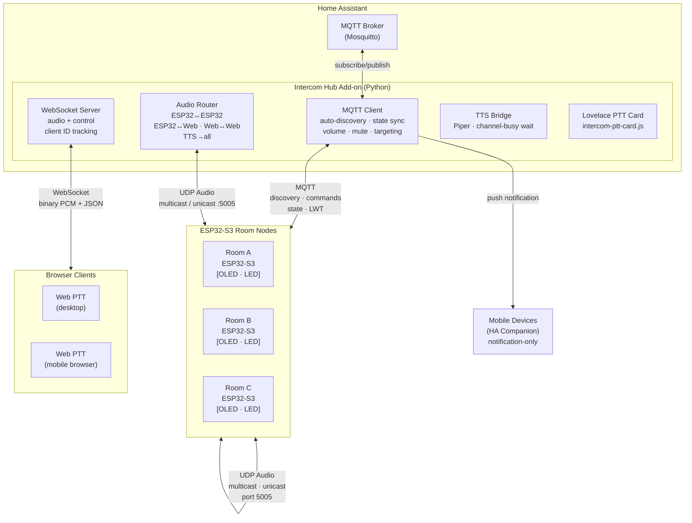
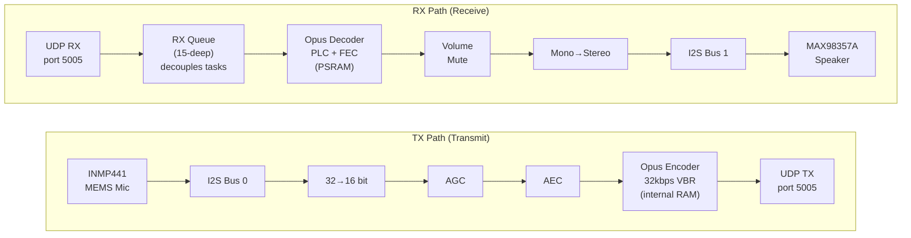
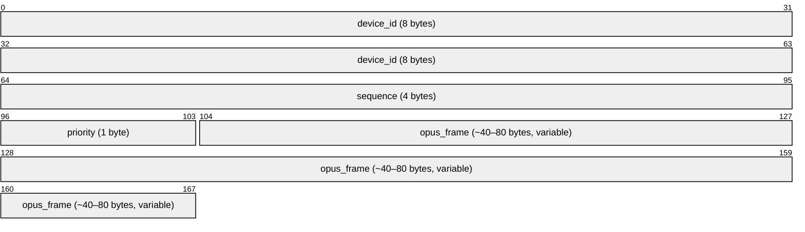

# HA Intercom

[](https://my.home-assistant.io/redirect/supervisor_add_addon_repository/?repository_url=https%3A%2F%2Fgithub.com%2FBri-J-C%2Fha-intercom)

ESP32-S3-based multi-room intercom system with Home Assistant integration.

## Features

- **Push-to-talk** intercom between rooms with first-to-talk collision avoidance
- **Multicast** for broadcast to all rooms, **unicast** for room-to-room
- **Web PTT** browser-based push-to-talk via Home Assistant ingress
- **Lovelace PTT card** for seamless HA dashboard integration (ingress or direct `hub_url` connection)
- **OLED display** with room selector, settings page, and availability tracking
- **Priority levels** (Normal, High, Emergency) with preemption
- **Do Not Disturb** mode with emergency override
- **Call notifications** with chime and LED flash
- **Opus codec** at 32kbps VBR with PLC/FEC for packet loss recovery
- **AGC** (Automatic Gain Control) for consistent mic levels
- **AEC** (Acoustic Echo Cancellation) via ESP-SR
- **Configurable mic gain** (0–100 scale, persisted in NVS)
- **AES-256-GCM encryption** for stored credentials (WiFi, MQTT, web passwords)
- **OTA firmware updates** via web interface
- **Reliable mDNS** with automatic re-enable on WiFi reconnect and 60-second periodic re-announcement
- **DHCP hostname** registration so routers display the correct device name
- **Audio reliability** improvements: decoupled RX receive/decode pipeline (15-deep queue + dedicated play task), reduced playback start latency (~40ms vs ~160ms), eliminated TX/RX buffer race conditions, silence-gated trail-out (200ms channel release vs 600ms), queue flush on PTT press to discard stale audio before transmitting, and thread-safe I2S state management via FreeRTOS mutex
- **Mobile device** auto-discovery and notification routing
- **TTS announcements** via Piper text-to-speech
- **Home Assistant integration** with MQTT auto-discovery, services, and automations
- **ESP32-S3** based hardware satellites (~$19/room with display)

## Architecture

### System Overview



### ESP32 Audio Flow



### Packet Format



**Header is always 13 bytes.** Priority values: `0` = Normal, `1` = High, `2` = Emergency.

## Components

| Directory | Description |
|-----------|-------------|
| `firmware/` | ESP32-S3 firmware (PlatformIO/ESP-IDF) |
| `intercom_hub/` | Home Assistant add-on for PTT hub, TTS, and routing |
| `tests/` | Integration test suite (65 tests across 10 categories) |
| `tools/` | Python utilities: `test_node.py` (MQTT call + UDP audio test harness), `protocol.py` (shared protocol constants), `ptt_client.py` (desktop PTT client), `notify.py` (mobile notification helper) |

## Quick Start

### 1. ESP32-S3 Hardware

**Required components (~$16 minimum):**
- ESP32-S3-DevKitC-1 (~$8) — has built-in BOOT button and RGB LED
- INMP441 I2S Microphone (~$3)
- MAX98357A I2S Amp + Speaker (~$5)

**Optional (~$3 extra):**
- SSD1306 128x64 OLED Display (~$3) — room selector and status display
- Momentary push button for room cycling (connect to GPIO10, active-low)

**Flash the firmware:**
- **Easy:** [Web Flasher](https://bri-j-c.github.io/ha-intercom/) — flash directly from browser (Chrome/Edge)
- **Manual:** Download from [Releases](https://github.com/Bri-J-C/ha-intercom/releases) and use esptool

See `firmware/README.md` for wiring instructions.

### 2. Home Assistant Add-on

**Option A: One-click install**

Click the button at the top of this README, or:

[](https://my.home-assistant.io/redirect/supervisor_add_addon_repository/?repository_url=https%3A%2F%2Fgithub.com%2FBri-J-C%2Fha-intercom)

**Option B: Manual install**

1. Go to **Settings → Add-ons → Add-on Store**
2. Click the 3-dot menu (top right) → **Repositories**
3. Add: `https://github.com/Bri-J-C/ha-intercom`
4. Find "Intercom Hub" in the store and install

**Configuration:**
- Configure MQTT broker settings (usually auto-detected)
- Configure Piper TTS host if using text-to-speech
- ESP32 devices auto-discover via MQTT
- Mobile devices can be added in the add-on config

### 3. Web PTT (Browser)

Access the Web PTT interface through the **Intercom** panel in Home Assistant's sidebar (added automatically by the add-on via ingress). Features:
- Push-to-talk button with visual TX/RX state
- Room/device selector dropdown
- Call button to ring specific rooms
- Works on desktop and mobile browsers

## Protocol

### Audio Transport

| Property | Value |
|----------|-------|
| Transport | UDP |
| Broadcast address | `239.255.0.100:5005` (multicast, all rooms) |
| Room-to-room | `<device-ip>:5005` (unicast) |
| Control port | `5004` (control messages) |
| Loopback prevention | `IP_MULTICAST_LOOP=0` on TX socket (hub and firmware) |

### Audio Format

| Property | Value |
|----------|-------|
| Codec | Opus VBR, voice mode, complexity 5 |
| Bitrate | 32 kbps |
| Sample rate | 16000 Hz |
| Channels | 1 (mono) |
| Frame duration | 20 ms (320 samples) |
| Error recovery | PLC (Packet Loss Concealment) + FEC (Forward Error Correction) |

### Control Plane

| Channel | Purpose |
|---------|---------|
| MQTT (HA broker) | Device discovery, state sync, volume, mute, room targeting, LWT |
| WebSocket (hub, port 8099) | Web PTT audio (binary PCM) and control messages (JSON) |
| mDNS | Local device discovery on LAN |
| HTTP (per-device) | Web config portal and OTA firmware updates |

### Discovery

Devices register via MQTT on connect and appear automatically in Home Assistant with auto-discovery entities. The hub tracks online/offline status via MQTT Last Will and Testament (LWT).

## Home Assistant Entities

### Per ESP32 Node

Each ESP32 device creates the following entities in Home Assistant via MQTT auto-discovery:

| Entity | Type | Description |
|--------|------|-------------|
| `sensor.{room}_state` | Sensor | `idle` / `transmitting` / `receiving` |
| `number.{room}_volume` | Number | Volume 0–100% |
| `switch.{room}_mute` | Switch | Mute toggle |
| `select.{room}_target` | Select | Target room for unicast |
| `switch.{room}_agc` | Switch | Automatic Gain Control |
| `number.{room}_mic_gain` | Number | Microphone sensitivity 0–100 |
| `select.{room}_priority` | Select | `Normal` / `High` / `Emergency` |
| `switch.{room}_dnd` | Switch | Do Not Disturb |
| `switch.{room}_led` | Switch | LED enabled/disabled |

### Hub Entities

| Entity | Type | Description |
|--------|------|-------------|
| `notify.intercom_hub` | Notify | Send TTS announcements to all rooms |
| `sensor.intercom_hub_state` | Sensor | `idle` / `transmitting` / `receiving` |
| `number.intercom_hub_volume` | Number | Hub volume 0–100% |
| `switch.intercom_hub_mute` | Switch | Hub mute toggle |
| `select.intercom_hub_target` | Select | Target room selector |
| `switch.intercom_hub_agc` | Switch | Hub AGC toggle |
| `select.intercom_hub_priority` | Select | Hub TX priority |
| `switch.intercom_hub_dnd` | Switch | Hub Do Not Disturb |

## Hardware Reference

### Pin Assignments

#### INMP441 Microphone — I2S Bus 0

| INMP441 pin | ESP32-S3 GPIO | Notes |
|-------------|---------------|-------|
| VDD | 3.3V | |
| GND | GND | |
| SCK | GPIO4 | I2S BCLK |
| WS | GPIO5 | I2S LRCLK |
| SD | GPIO6 | I2S data |
| L/R | GND | Selects left channel |

#### MAX98357A Amplifier — I2S Bus 1

| MAX98357A pin | ESP32-S3 GPIO | Notes |
|---------------|---------------|-------|
| VIN | 5V | |
| GND | GND | |
| BCLK | GPIO15 | |
| LRC | GPIO16 | |
| DIN | GPIO17 | |
| GAIN | NC or GND | 15dB gain when GND |

#### SSD1306 OLED Display (Optional) — I2C

| SSD1306 pin | ESP32-S3 GPIO | Notes |
|-------------|---------------|-------|
| VCC | 3.3V | |
| GND | GND | |
| SDA | GPIO8 | |
| SCL | GPIO9 | |

I2C address: `0x3C` (default for most SSD1306 modules)

#### Buttons and LED

| Component | GPIO | Notes |
|-----------|------|-------|
| PTT button | GPIO0 | Built-in BOOT button on DevKitC-1, active-low |
| WS2812 LED | GPIO48 | Built-in RGB LED on DevKitC-1 |
| Cycle button | GPIO10 | Optional, active-low, internal pull-up |

### LED State Reference

| Color | State |
|-------|-------|
| White (dim) | Idle, connected |
| Cyan | Transmitting (PTT active) |
| Green | Receiving audio |
| Red | Muted |
| Orange | Channel busy (another device transmitting) |
| Purple | Do Not Disturb active |
| Blinking red | Error or connecting to WiFi |

### Button Behavior

**PTT button (GPIO0 — BOOT):**
- **Press and hold** — Start transmitting; LED turns cyan
- **Release** — Stop transmitting; LED returns to idle state

**Cycle button (GPIO10):**
- **Short press** — Cycle to next room in OLED room list
- **Long press (1s)** — Send call/ring notification to selected room
- **Long press on "Settings" entry** — Enter OLED settings page

## Hub API Reference

The hub exposes an HTTP API on port 8099 for QA and diagnostics.

### Audio Stats

```
GET  /api/audio_stats          Query per-sender UDP receive statistics
POST /api/audio_stats          Reset stats (body: {"older_than": <seconds>} or {})
```

**GET /api/audio_stats response:**
```json
{
  "current_state": "idle",
  "current_sender": null,
  "senders": {
    "<device_id_hex>": {
      "first_rx": 1706000000.0,
      "last_rx":  1706000005.0,
      "packet_count": 250,
      "seq_min": 1,
      "seq_max": 250,
      "priority": 0,
      "age_seconds": 1.2,
      "duration_seconds": 5.0
    }
  },
  "tx": {
    "packets": 150,
    "errors": 0
  }
}
```

### Audio Capture

```
GET  /api/audio_capture        Fetch captured audio frames
POST /api/audio_capture        Control capture: {"action": "start"|"stop"|"clear"}
```

**GET /api/audio_capture query parameters:**
- `direction` — `"rx"` (received from ESP32) or `"tx"` (sent by hub)
- `device_id` — filter by device ID hex string
- `since` — Unix timestamp float
- `limit` — maximum frames to return (default 500)

### Chime Management

```
GET    /api/chimes             List available chimes
POST   /api/chimes/upload      Upload a new chime file
DELETE /api/chimes/{name}      Delete a chime
```

Chimes are stored persistently in `/data/chimes/` on the HA host. Bundled defaults are in the container image at `/chimes/`.

### WebSocket PTT

```
GET /ws                        WebSocket endpoint for Web PTT clients
```

Clients send JSON control messages and binary 640-byte PCM frames (320 samples × 16-bit). The hub Opus-encodes and forwards to ESP32 nodes via UDP.

## Firmware HTTP API

Each ESP32 device exposes an HTTP API on port 80.

All endpoints except the configuration page require HTTP Basic Authentication (`admin` / your configured web password). If no password is set, all endpoints are accessible without authentication.

### Status

```
GET /api/status
```

Returns device state JSON. Example response:
```json
{
  "version": "2.9.4",
  "room": "Bedroom",
  "target_room": "All Rooms",
  "transmitting": false,
  "receiving": false,
  "sustained_tx_active": false,
  "audio_playing": false,
  "mqtt_connected": true,
  "volume": 80,
  "muted": false,
  "dnd": false,
  "priority": 0,
  "agc_enabled": true,
  "free_heap": 180000,
  "rx_packet_count": 1250,
  "tx_frame_count": 430
}
```

### Test Actions

```
POST /api/test
Content-Type: application/json

{"action": "<action>", ...}
```

| Action | Description | Extra fields |
|--------|-------------|--------------|
| `beep` | Play a short local beep | — |
| `test_tone` | Generate a 440 Hz sine wave, Opus-encode, and transmit via UDP. For durations ≤ 3s (150 frames): synchronous response. For longer durations: returns immediately, poll `/api/status` for `sustained_tx_active=false`. | `"duration_frames"` (default 150, min 1, max 600) |
| `sustained_tx` | Transmit real microphone audio via UDP for a fixed duration. Returns immediately; poll `/api/status` for `transmitting=false`. | `"duration"` (seconds, float) |
| `reboot` | Restart the device | — |

Returns `409 Conflict` if PTT is active or a test is already running.

### Diagnostics

```
GET /diagnostics        HTML diagnostics page
GET /diagnostics/json   JSON diagnostics
```

### Configuration

```
GET  /          Web configuration portal (HTML)
POST /save      Save settings
POST /reboot    Restart device
POST /reset     Factory reset (requires CSRF token from web form)
POST /update    OTA firmware upload
```

## Automations Example

```yaml
alias: Doorbell Announcement
description: "Announce when someone rings the doorbell"
triggers:
  - trigger: state
    entity_id:
      - binary_sensor.doorbell
    to: "on"
actions:
  - action: notify.intercom_hub
    data:
      message: "Someone is at the door"
mode: single
```

## Credits

[Intercom icons created by Dixit Lakhani_02 - Flaticon](https://www.flaticon.com/free-icons/intercom)

## License

MIT
