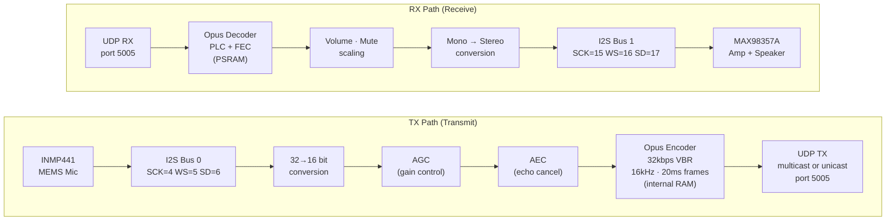

# HA Intercom

ESP32-S3-based multi-room intercom system with Home Assistant integration.

## Features

- **Push-to-talk** intercom between rooms with first-to-talk collision avoidance
- **Multicast** for broadcast to all rooms, **unicast** for room-to-room
- **Web PTT** browser-based push-to-talk via Home Assistant ingress
- **Lovelace PTT card** for seamless HA dashboard integration
- **OLED display** with room selector, settings page, and availability tracking
- **Priority levels** (Normal, High, Emergency) with preemption
- **Do Not Disturb** mode with emergency override
- **Call notifications** with chime and LED flash
- **Opus codec** at 32kbps VBR with PLC/FEC for packet loss recovery
- **AGC** (Automatic Gain Control) for consistent mic levels
- **AEC** (Acoustic Echo Cancellation) via ESP-SR
- **AES-256-GCM encryption** for stored credentials (WiFi, MQTT, web passwords)
- **OTA firmware updates** via web interface
- **Mobile device** auto-discovery and notification routing
- **TTS announcements** via Piper text-to-speech
- **Home Assistant integration** with MQTT auto-discovery, services, and automations
- **ESP32-S3** based hardware satellites (~$19/room with display)

## Architecture

### System Overview

### ESP32 Audio Flow

### Packet Format

**Header is always 13 bytes.** Priority values: `0` = Normal, `1` = High, `2` = Emergency.

## Components

| Directory | Description |
|-----------|-------------|
| `firmware/` | ESP32-S3 firmware (PlatformIO/ESP-IDF) |
| `intercom_hub/` | Home Assistant add-on for PTT hub, TTS, and routing |
| `tools/` | Python test client for protocol development |

## Quick Start

### 1. ESP32-S3 Hardware

**Required components (~$16 minimum):**
- ESP32-S3-DevKitC-1 (~$8) - has built-in BOOT button and RGB LED
- INMP441 I2S Microphone (~$3)
- MAX98357A I2S Amp + Speaker (~$5)

**Optional (~$3 extra):**
- SSD1306 128x64 OLED Display (~$3) - room selector and status display
- Momentary push button for room cycling (or use any GPIO10-connected button)

**Flash the firmware:**
- **Easy:** [Web Flasher](https://bri-j-c.github.io/ha-intercom/) - flash directly from browser (Chrome/Edge)
- **Manual:** Download from [Releases](https://github.com/Bri-J-C/ha-intercom/releases) and use esptool

See `firmware/README.md` for wiring instructions.

### 2. Home Assistant Add-on

**Option A: One-click install**

Click the button at the top of this README, or:

**Option B: Manual install**

1. Go to **Settings → Add-ons → Add-on Store**
2. Click the 3-dot menu (top right) → **Repositories**
3. Add: `https://github.com/Bri-J-C/ha-intercom`
4. Find "Intercom Hub" in the store and install

**Configuration:**
- Configure MQTT broker settings (usually auto-detected)
- Configure Piper TTS host if using text-to-speech
- ESP32 devices auto-discover via MQTT
- Mobile devices can be added in the add-on config

### 3. Web PTT (Browser)

Access the Web PTT interface through the **Intercom** panel in Home Assistant's sidebar (added automatically by the add-on via ingress). Features:
- Push-to-talk button with visual TX/RX state
- Room/device selector dropdown
- Call button to ring specific rooms
- Works on desktop and mobile browsers

## Protocol

### Audio Transport

| Property | Value |
|----------|-------|
| Transport | UDP |
| Broadcast address | `224.0.0.100:5005` (multicast, all rooms) |
| Room-to-room | `<device-ip>:5005` (unicast) |
| Loopback prevention | `IP_MULTICAST_LOOP=0` on TX socket (hub and firmware) |

### Audio Format

| Property | Value |
|----------|-------|
| Codec | Opus VBR, voice mode, complexity 5 |
| Bitrate | 32 kbps |
| Sample rate | 16000 Hz |
| Channels | 1 (mono) |
| Frame duration | 20 ms (320 samples) |
| Error recovery | PLC (Packet Loss Concealment) + FEC (Forward Error Correction) |

### Control Plane

| Channel | Purpose |
|---------|---------|
| MQTT (HA broker) | Device discovery, state sync, volume, mute, room targeting, LWT |
| WebSocket (hub) | Web PTT audio (binary PCM) and control messages (JSON) |
| mDNS | Local device discovery on LAN |
| HTTP | Web config portal and OTA firmware updates (per-device) |

### Discovery

Devices register via MQTT on connect and appear automatically in Home Assistant with auto-discovery entities (sensor, switch, number). The hub tracks online/offline status via MQTT Last Will and Testament (LWT).

## Credits

[Intercom icons created by Dixit Lakhani_02 - Flaticon](https://www.flaticon.com/free-icons/intercom)

## License

MIT
